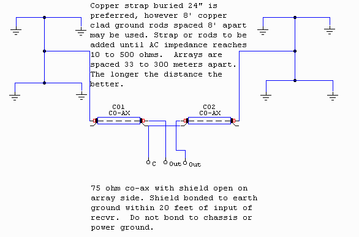
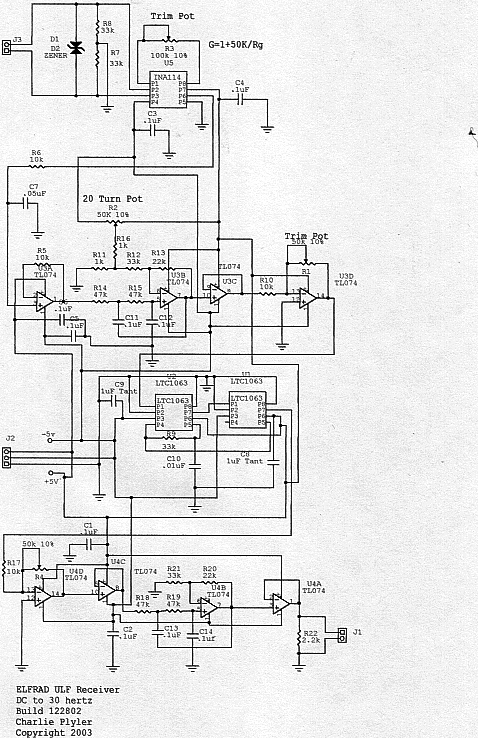
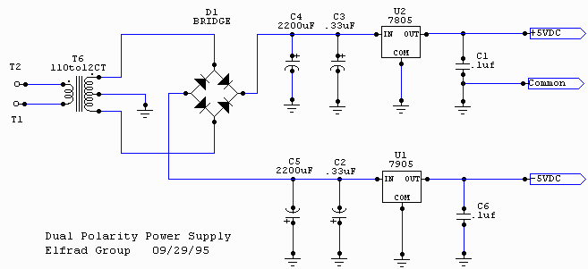

# ELFRAD - Charlie Plyler's ULF / ELF Research

*Preserving the legacy of Charles "Charlie" Plyler*  
*Extremely Low Frequency Research and Development (ELFRAD)*

## Welcome

This site is an open-source archive of my father Charlie Plyler's pioneering work on detecting ultra-low frequency (ULF) and extremely low frequency (ELF) electromagnetic signals from the Earth. 

His system was designed to identify earthquake precursors, often providing 30–90 minutes or more advance warning.

The original website was at *elfradgroup.com*. We are rebuilding and open-sourcing everything here.

## The Antenna System  
*The Earth is a Major Component*

Charlie's antenna was *not* a sky antenna. It was a buried earth dipole system:

- Short copper wires buried in a small section of his 4.5-acre property  
- Deeper ground rods (buried deeper than the wires) surrounded by rock salt to lower resistance  
- *The Earth itself* was a key part of the design — it acted as the main medium for capturing telluric currents and geophysical signals

This ground-coupled approach is what gave the system its sensitivity to subtle ULF/ELF signals from stressed fault zones.

## The Receiver & Schematics

## Vision for the Future

This research has potential far beyond Earth:

- Better earthquake early warning systems  
- Opening a new scientific field of *Planetary Electromagnetic Seismology*  
- Seismic and gravity wave monitoring for *Mars colonization* and future space habitats  

## Funding & Collaboration

We are actively looking for interested investors and partners to help rebuild, modernize, and test the primary ELFRAD operating system

If you are interested in supporting this project, please reach out 

## Archive Note

The full original website content from elfradgroup.com (including all archived pages) will be available on the future full ELFRAD website. This GitHub site currently serves as the basic landing page and hosts the scanned schematics and key diagrams. 

## Contact

**Email:** museterina@gmail.com
